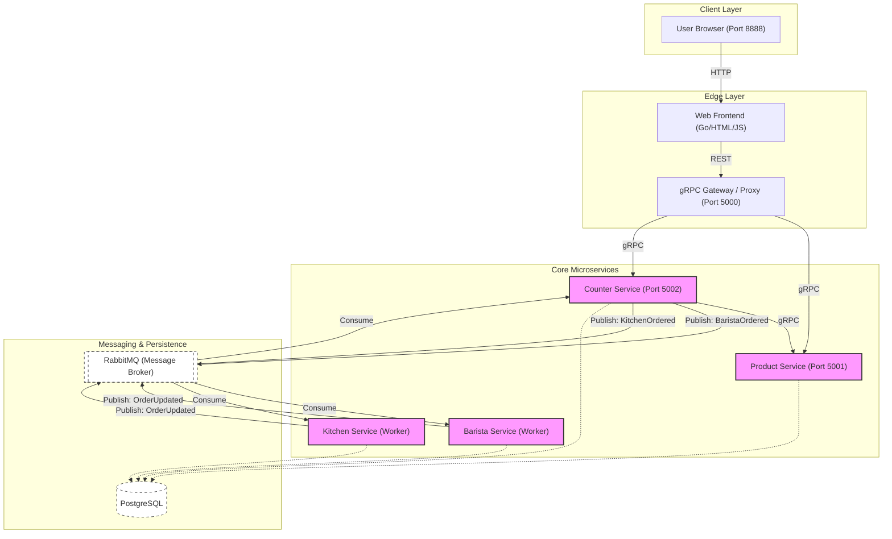

# Go CoffeeShop Architecture

This document describes the architectural design of the **Go CoffeeShop** project, a distributed system built with Go following Clean Architecture and DDD principles.

## High-Level Diagram (Mermaid)

The following diagram illustrates the event-driven microservices flow, emphasizing the choreography saga pattern and communication protocols.



## Static Representation (ASCII)

For environments where Mermaid is not supported:

```text
                                 [ USER BROWSER ]
                                        |
                                        | (HTTP/8888)
                                        v
+-----------------------------------------------------------------------+
|                            WEB FRONTEND (Go)                          |
+-----------------------------------------------------------------------+
                                        |
                                        | (REST/JSON)
                                        v
+-----------------------------------------------------------------------+
|                       gRPC GATEWAY / PROXY (5000)                     |
+-----------------------------------------------------------------------+
             |                                          |
             | (gRPC)                                   | (gRPC)
             v                                          v
+-----------------------+                   +---------------------------+
|    PRODUCT SERVICE    |                   |      COUNTER SERVICE      |
|        (5001)         | <---------------- |          (5002)           |
+-----------------------+       (gRPC)      +---------------------------+
             |                                          |
             |                                          | (Publish Events)
             |                                          v
             |                        +---------------------------------+
             |                        |           RABBITMQ              |
             |                        |       (Message Broker)          |
             |                        +---------------------------------+
             |                          ^       |                |
             |                          |       |                |
             |          (Update Events) |       | (Consume)      | (Consume)
             |                          |       v                v
             |                +--------------------+  +--------------------+
             |                |   BARISTA WORKER   |  |   KITCHEN WORKER   |
             |                +--------------------+  +--------------------+
             |                           |                      |
             v                           v                      v
+-----------------------------------------------------------------------+
|                            POSTGRESQL DATABASE                        |
|        (Schemas: product_db, counter_db, barista_db, kitchen_db)      |
+-----------------------------------------------------------------------+
```

## Architectural Breakdown

### 1. Communication Patterns
- **Synchronous (gRPC/REST):** Used for immediate user-facing requests and real-time data lookups (e.g., the Counter service calling the Product service to verify item prices).
- **Asynchronous (AMQP/RabbitMQ):** Implements the **Choreography Saga**. This decouples the Counter from the potentially long-running tasks of preparing coffee (Barista) or food (Kitchen).

### 2. Service Responsibilities
- **Web:** A simple Go-based frontend that serves the UI and interacts with the gRPC gateway.
- **Proxy (gRPC-Gateway):** Acts as the entry point for external REST clients, translating HTTP/JSON requests into internal gRPC calls.
- **Counter Service:** Manages orders, initiates the fulfillment process via events, and tracks overall order status.
- **Product Service:** Manages the catalog of available coffee and food items.
- **Barista & Kitchen Services:** Background workers that "process" items and report completion back to the system.

### 3. Data Integrity & Persistence
- **DDD Principles:** Each service owns its domain logic and data.
- **PostgreSQL:** While sharing a physical instance for development, each service uses its own schema to maintain strict data isolation.
- **Choreography Saga:** Distributed transactions are handled through events. If a step fails, the system is designed to handle compensating actions (though currently, it focuses on the success path).

### 4. Infrastructure & Deployment
- **Local Dev:** Orchestrated via `docker-compose`.
- **Cloud Native:** Configured for deployment using **HashiCorp Nomad**, **Consul** (for service mesh), and **Vault** (for secret management).
